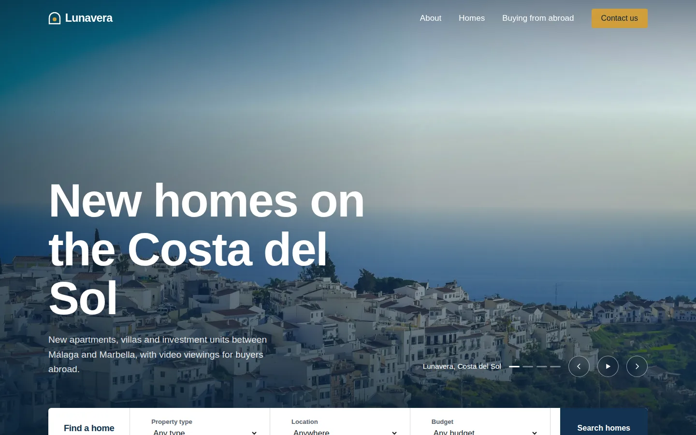

# Lunavera Homes: AI Lead Qualification Demo

A property landing page for a fictional Costa del Sol developer, built as the front end of an **AI lead qualification workflow**. Enquiries from the form are sent to an n8n webhook, where an LLM scores each lead, extracts the key details and drafts a personalised reply.

> **Lunavera Homes is a fictional business.** All listings, prices and contact details are made up for portfolio purposes.

**Live demo:** https://YOUR-PROJECT.pages.dev



---

## The problem it solves

Property developers get enquiries from all over the world, at all hours, in different languages. Sales teams lose good buyers by replying slowly, and waste time on enquiries that were never going to buy.

This project automates the first step:

1. A buyer sends an enquiry from the website.
2. AI reads it within seconds and scores it **hot**, **warm** or **cold**.
3. Hot leads trigger an instant alert to the sales team.
4. A personalised follow-up email is drafted in the buyer's own language, ready for a human to review and send.

## How it works

```
Website form (Cloudflare Pages)
        │  JSON via fetch()
        ▼
n8n webhook
        │
        ├─ Verify Cloudflare Turnstile token
        ├─ Drop spam (honeypot field)
        ▼
LLM qualification → structured JSON
(score, reason, budget, timeline, purpose, urgency, summary, language)
        │
        ├─ Hot   → Discord alert + drafted reply
        ├─ Warm  → logged + drafted nurture email
        └─ Cold / spam → logged only
        ▼
Google Sheets lead log + Gmail drafts
```

## Features

### Front end

- **Hand-built static site**: HTML, CSS and vanilla JavaScript, with no framework or build step
- **Hero slideshow** with previous, next and pause controls
- **Working property search** that filters listings by type, location and budget
- **Buyer-purpose tabs** (live in / holiday home / investment) that pre-fill the enquiry form, so the AI receives cleaner data
- **Scroll and load animations** with a staggered headline, image reveals and number count-ups
- **Accessible**: keyboard-navigable tabs, visible focus states, labelled form fields, and all motion switched off for visitors with "reduce motion" enabled
- **Responsive** from mobile to wide desktop
- **Optimised images**: all photos resized and converted to WebP (about 2 MB total)

### Security and spam protection

- **Cloudflare Turnstile** on the enquiry form, with the token verified server-side in n8n
- **Honeypot field** to catch basic bots
- **Content-Security-Policy and security headers** set through Cloudflare Pages' `_headers` file
- Client-side validation, with server-side checks before anything reaches the LLM

### Automation (n8n)

> 🚧 **In progress.** The workflow export will be added to `/workflow`.

- Webhook intake and validation
- LLM lead scoring with structured JSON output
- Routing by lead score
- Google Sheets logging, Discord alerts and Gmail drafts
- Replies drafted in the enquiry's language (English and Spanish tested)

## Tech stack

| Area | Tools |
|---|---|
| Front end | HTML5, CSS3, JavaScript |
| Hosting | Cloudflare Pages (auto-deploy from GitHub) |
| Security | Cloudflare Turnstile, CSP via `_headers` |
| Automation | n8n |
| AI | LLM API (structured output) |
| Outputs | Google Sheets, Gmail, Discord webhooks |
| Images | Python and Pillow (resizing, cropping, WebP conversion) |

## Project structure

```
lunavera-homes/
├── index.html      # The landing page (HTML, CSS and JS in one file)
├── _headers        # Cloudflare Pages security headers and CSP
├── images/         # Optimised WebP photos
├── docs/           # Screenshots for this README
└── README.md
```

## Run it locally

No build step is needed. Either open `index.html` in a browser, or serve the folder:

```bash
# from inside the project folder
python -m http.server 8000
# then visit http://localhost:8000
```

Until a webhook URL is set, the form runs in **demo mode**: submitting it shows the thank-you message and logs the exact JSON payload to the browser console.

## Configuration

| What | Where | Notes |
|---|---|---|
| n8n webhook URL | `index.html` → `CONFIG.WEBHOOK_URL` | Leave as-is for demo mode |
| Turnstile site key | `index.html` → `data-sitekey` | Currently Cloudflare's test key, which always passes |
| n8n domain in the CSP | `_headers` → `connect-src` | Must match the webhook's domain or the browser blocks the request |
| CORS | n8n Webhook node → Allowed Origins | Set to your Pages domain |

The **Turnstile secret key** and all **API keys** live in n8n, never in this repo.

## Example payload

```json
{
  "full_name": "Ana García",
  "email": "ana@example.com",
  "country": "Spain",
  "listing": "Mirador Penthouse",
  "budget": "€400,000 – €700,000",
  "timeline": "In 3–6 months",
  "financing": "Mortgage, already approved",
  "purpose": "Holiday home",
  "wants_viewing": true,
  "viewing_type": "Video call",
  "message": "Hola, me interesa el ático. ¿Podemos hacer una videollamada esta semana?",
  "meta": {
    "submitted_at": "2026-10-02T09:15:00.000Z",
    "browser_language": "es-ES",
    "source": "lunavera-landing-page"
  }
}
```

## Photo credits

Photos from [Unsplash](https://unsplash.com) and [Pexels](https://www.pexels.com), used under their free licences.

| Image | Photographer | Source |
|---|---|---|
| Hero | Lucas Albuquerque | Unsplash |
| Villa Serena | Frames For Your Heart | Unsplash |
| Mirador Apartments | Imren Tutuncu | Pexels |
| Mirador Penthouse | Crono Viento | Pexels |
| Paseo Commercial Unit | Kristina Bekher | Pexels |
| About | Mark Owen-Wilkinson Hughes | Unsplash |
| To live in | santiagob | Pexels |
| Holiday home | thephotosaccount | Pexels |
| Investment | Jakub Żerdzicki | Unsplash |
| Enquire | Tierra Mallorca | Unsplash |

## Author

**Leizyl M. Cruz**, Web Developer & Automation Specialist
[LinkedIn](https://linkedin.com/in/leizylmcruz)
